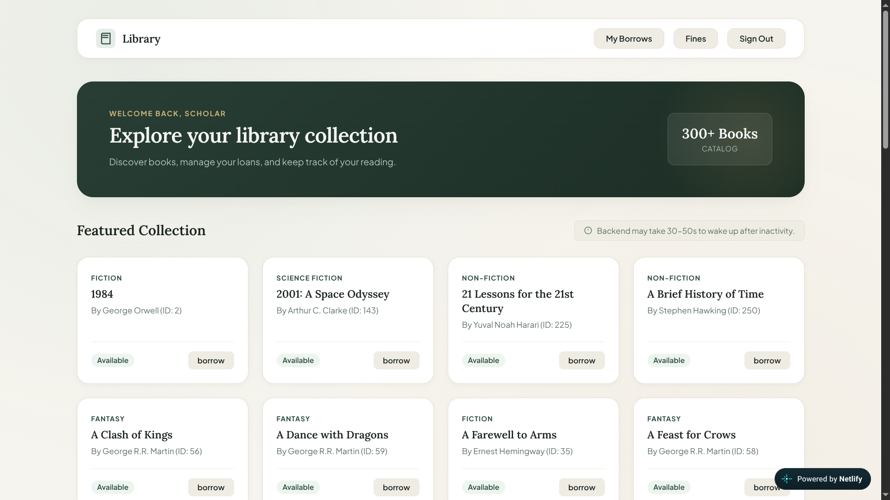
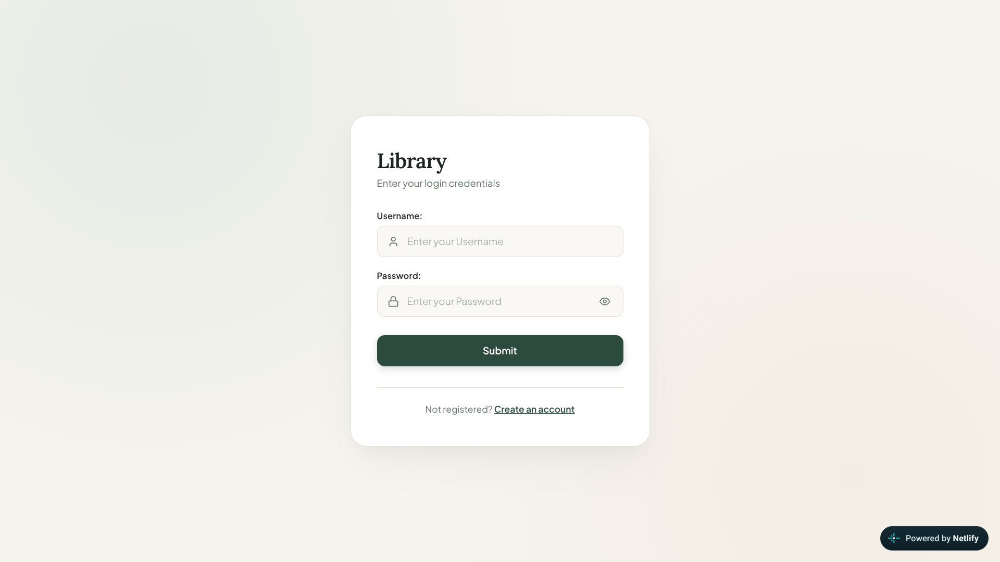

# Library Management System
 
A full-stack library system with librarian and member roles, borrowing limits, and automatic late-fine calculation. Built with Django, Django REST Framework and PostgreSQL, deployed with tests and API docs. This is my first complete project.
 
**Live demo:** https://harsh-library.netlify.app/
**API docs (Swagger):** https://library-3o9m.onrender.com/api/docs/
**Backend (Render):** https://library-3o9m.onrender.com
 
> The backend runs on Render's free tier, so the first request after an idle period can take up to a minute. Please be patient.
 
## Try it
 
| Role | Username | Password |
|------|----------|----------|
| Member | `test_user` | `test_password` |
 
## Screenshots
 



 
## Features
 
- Two roles: librarian and member, with a custom user model
- Members can borrow a book for up to 1 month
- Maximum of 5 books borrowed at a time
- Late returns are fined automatically, based on the number of late days
- Borrowing is blocked until fines are paid once a member has 2 unpaid fines
- Book pagination
- Session authentication with CSRF protection
- Admin activity logs
- 23 automated tests and Swagger API documentation
## Tech stack
 
- **Backend:** Python, Django, Django REST Framework
- **Database:** PostgreSQL
- **Frontend:** HTML, CSS, JavaScript
- **Auth:** Session authentication + CSRF protection
- **Testing:** Django `APITestCase`
- **Deployment:** Render (backend), Netlify (frontend)
- **Tools:** Linux, Git and GitHub, Thunder Client
## Run it locally
 
1. Clone the repo and enter the backend folder:
```bash
   git clone https://github.com/Harsh-dev-8/Library-Management-project
   cd Library-Management-project/Backend
```
2. Create and activate a virtual environment:
```bash
   python -m venv .venv
   source .venv/bin/activate
```
3. Install dependencies:
```bash
   pip install -r requirements.txt
```
4. Create a PostgreSQL database, then copy the sample environment file and fill in your own values:
```bash
   cp .env.example .env
```
   Never commit your `.env` file.
5. Run the migrations and start the server:
```bash
   python manage.py migrate
   python manage.py runserver
```
   (`runserver` is for development only, never for production.)
 
## Run the tests
From the `Backend/` folder:
```bash
python manage.py test
```
## What I learned
 
- Building a REST API end to end: models, serializers, views, permissions and URLs
- Role-based access with a custom user model (librarian vs member)
- Session authentication and CSRF protection when the frontend and backend are on different domains
- Writing tests for the borrow, return and fine logic
- Deploying a backend and a frontend separately, and handling environment variables safely
- For next project i will make different than CRUDs more with monitoring, observability, servers, infra etc
## Author
 
Harsh: [GitHub](https://github.com/Harsh-dev-8)
